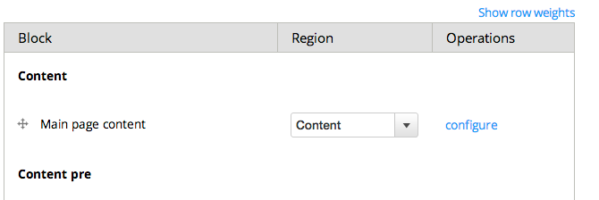
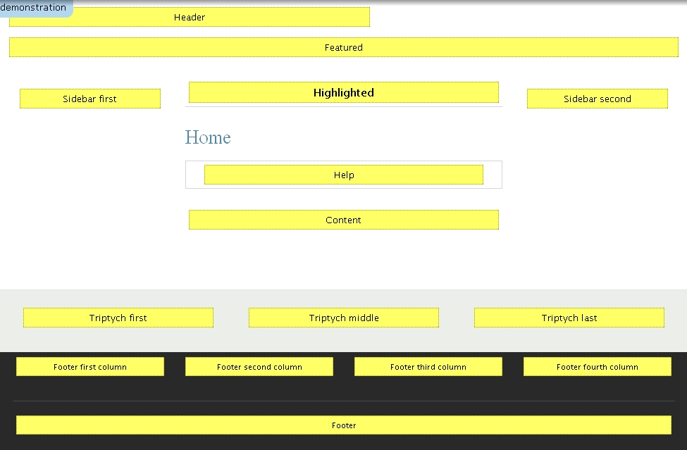
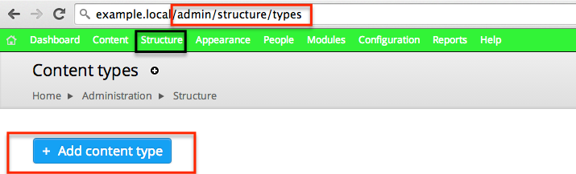
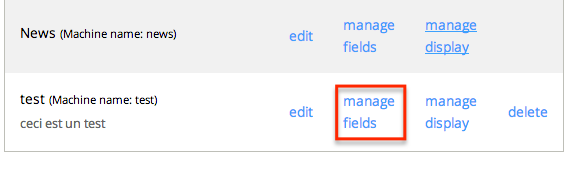
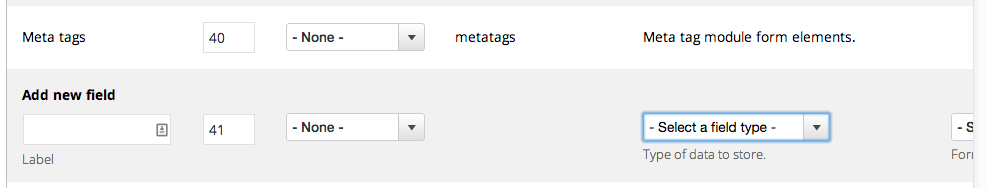
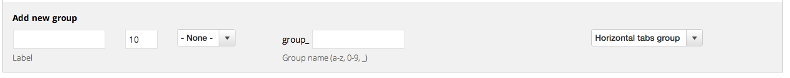
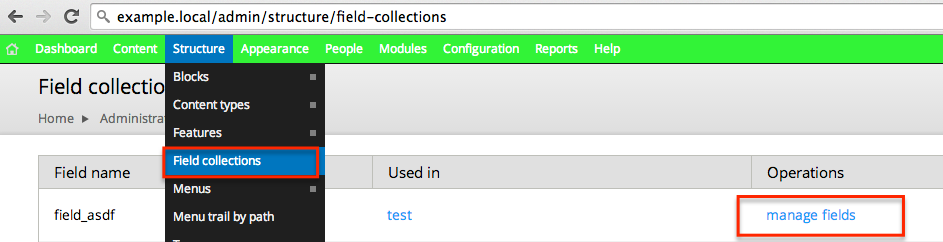
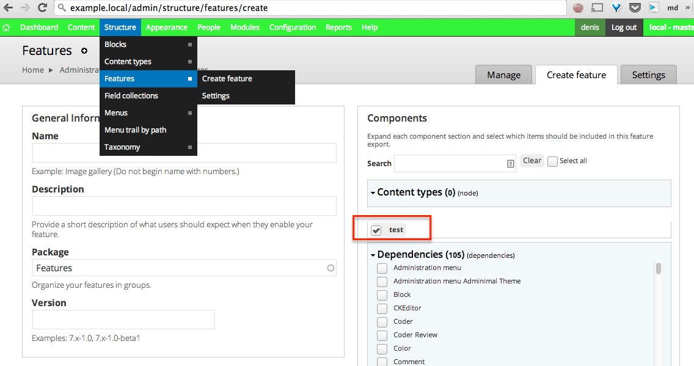

# Initiation à Drupal
## Présentation
La présentation est disponible à cet url.

[bit.ly / drupal-ini](http://bit.ly/drupal-ini)

[initiation-a-drupal.pdf](http://denislaliberte.github.io/initiation-a-drupal/initiation-a-drupal.pdf)

## Agenda
- Drush
- Module et hook
- Theme
- Configuration

## Drush

### Drupal shell

Drush, c'est le Drupal shell, c'est l'outil en ligne de commande de Drupal.


[Documentation | drush.org](http://www.drush.org/en/master/)


### Project manager

Drush contient un gestionnaire de projet, qui peut télécharger et faire les mises à jour du core de Drupal, des thèmes et des modules.

```bash
$ cd ~/Sites
$ drush pm-download
Project drupal (7.34) downloaded to /Users/dl/Sites/drupal-7.34
```


### Installation

Drush permet d'installer Drupal, ce qui créé ou écrase la base de données et les fichiers de configuration.

```bash
$ cd /Users/dl/Sites/drupal-7.34
$ drush site-install standard \
```


### Mise à jours

On peut faire les mises à jour du code des modules et du core, ainsi que la base de données par Drush.

```bash
$ drush pm-updatecode
No code updates available.

$ drush updatedb
No database updates required
```


### Variables

Drush permet d'inspecter et de modifier les variables de Drupal.
```bash
$ drush variable-get name

$ drush variable-set site_name new-name
site_name was set to "new-name".
```

### Script

On peut utiliser Drush pour exécuter des scripts PHP, ce qui est pratique pour explorer l'api.

```bash
$ echo "<?php var_dump(menu_tree_page_data('main-menu'));" \
  > test.php
$ drush php-script test.php
 array(1) {
   '50000 Home 218' =>
   [...]
```


### Gestion des modules

On peut aussi gérer les téléchargements, installations et mises à jour des modules.

Avec la commande suivante, on télécharge le projet "example"de Drupal. Ce sont des exemples de module pour apprendre à travailler avec les api backend de Drupal.

```bash
$ drush pm-download example
Project examples (7.x-1.x-dev) downloaded to sites/all/modules/examples.
```

[Examples for Developers | drupal.org](https://www.drupal.org/project/examples)


## Module et hook

- Block
- Menu
- Theme
- Preprocess
- Variable
- Query
- Entity api

Lorsque l'on veut intéragir avec le code de Drupal, on utilise le système de hook et de module de Drupal. Nous allons couvrir quelques hook et api qui sont disponibles
dans les modules.
## block_example

Nous allons étudier le module 'block_example' , qui démontre comment créer un block custom.

Un module contient au minimum un fichier de configuration block_example.info et 
un fichier avec le code block_example.module.

Le fichier block_example.install contient le script d'installation et le block_example.test
contient les tests d'intégration Drupal avec Simple Test.

```console
$ cd sites/all/modules/examples/block_example
$ ls
block_example.info
block_example.install
block_example.module
block_example.test
```


### block_example.info
Le fichier info contient l'information du module qui sera affichée dans 
l'interface d'administration ou dans la commande `drush pm-info`.

```
name = Block Example
description = An example outlining how a module can define blocks.
package = Example modules
core = 7.x
```


### HOOK_block_info

Dans le fichier .module,  on définit des hooks pour que Drupal puisse appeler notre 
code. Les hooks sont des fonctions qui débutent avec le nom du module.

Par exemple, pour implémenter hook_block_info on définit une fonction avec le nom
block_example_block_info().

```php
/**
 * Implements hook_block_info().
 *
 * This hook declares what blocks are provided by the module.
 */
  function block_example_block_info() {
```


### HOOK_block_info
Le hook block_info: on retourne les informations de notre bloc à Drupal.

```php
  $blocks['example_uppercase'] = array(
    'info' => t('Example: uppercase this please'),
    'status' => TRUE,
    'region' => 'sidebar_first',
  );
  return $blocks;
 }
```


### documentation

Les valeurs possibles de l'array de bloc sont documentées sur le site de Drupal.org

Et la liste des hooks disponibles se trouve dans le lien suivant.

[hook_block_info | drupal.org](https://api.drupal.org/api/drupal/modules%21block%21block.api.php/function/hook_block_info/7)

[hooks | drupal.org](https://api.drupal.org/api/drupal/includes%21module.inc/group/hooks/7)


example.local/admin/structure/block
Lorsque Drupal a les informations du bloc, on peut l'assigner à une région dans 
l'interface administrateur.




### hook_block_view

Le hook block view est appelé par Drupal avant d'afficher les blocs et le machine
name du block est passé en argument.

```php
function block_example_block_view($delta = '') {
  switch ($delta) {
    case 'example_configurable_text':
```

### example_empty

On a simplement à ajouter la string que nous voulons afficher comme valeur à 
la clé 'content' pour qu'elle s'affiche dans le bloc.
```php
    case 'example_empty':
      $block['subject'] = t('Title of second block');
      $block['content'] = block_example_contents($delta);
    break;
```


## hook_menu

Les routes dans Dupal sont déclarées en utilisant le hook menu. Ça porte à confusion 
au début, mais pour les développeur Drupal, un menu ce n'est pas un menu, c'est une 
route, (le path) pour accéder à une page custom.

Nous allons regarder les exemples fournis par Drupal.


```bash
$cd ~/Sites/drupal-7.34/sites/all/modules/examples/menu_example

$ls
menu_example.info   menu_example.module menu_example.test
```


### menu_example.module

Dans le fichier menu_example.module on définit le hook_menu que nous allons 
utiliser pour retourner les informations sur nos routes à Drupal.

```php
/**
 * Implements hook_menu().
 *
 * A simple example which defines a page callback and a menu entry.
 */
function menu_example_menu() {
```


Si on veux ajouter la routeexamples/menu_example à notre projet,
on ajoute la route comme clé à l'array que retourne le hook et 
on déclare une fonction callback et une validation d'accès.

En retournant 'TRUE', on s'assure que tout les rôles ont accès
à notre page.

example.local/examples/menu_example

```php
function menu_example_menu() {
 $items['examples/menu_example'] = array(
   'page callback' => '_menu_example_basic_instructions',
    'access callback' => TRUE,
    );
  return $items;
}
```


### Callback

La fonction callback définie dans le hook_menu retourne le markup à afficher
dans le contenu de la route.


```php
function _menu_example_basic_instructions($content = NULL) {
  $base_content = t(
  'This is the base page of the Menu Example. There are a number of examples
  here, from the most basic (like this one) to extravagant mappings of loaded
  placeholder arguments. Enjoy!');
  return '<div>' . $base_content . '</div><br /><div>' . $content . '</div>';
```


### Documentation hook_menu

Voici la documentation du hook menu et celle du hook_i18n_translate_path qui
est pratique pour associer les routes des différentes langues pour que Drupal
puisse construire le language switcher.

[ hook_menu | drupal.org ](https://api.drupal.org/api/drupal/modules%21system%21system.api.php/function/hook_menu/7)

[ hook_i18n_translate_path | drupalcontrib.org ](http://drupalcontrib.org/api/drupal/contributions!i18n!i18n.api.php/function/hook_i18n_translate_path/7)


## hook_theme

### my_example.module
Le module theming_example.module démontre différent exemples d'utilisation du 
hook_theme. Souvent on l'utilise simplement pour créer un template custom dans un 
module.

On n'a qu'à retourner la clé de notre thème et le nom du fichier template au hook.

```php
function my_example_theme() {
  return [
    'my_theme_key' => [
      'template' => 'my-template-name'
    ]
  ];
}
```


### my-template-name.tpl.php

Dans notre exemple, on déclare un fichier template qui affiche la variable $title
dans une balise h1.
```php
  <h1><?php print $title ?></h1>
```

### theme( $key, $variables )
Puis, lorsqu'on utilise cette clé dans la fonction thème, ça nous retourne une 
chaine de caractères contenant le markup du fichier template my-template-name.tpl.php

Par exemple, ici on utilise notre template dans un callback de menu pour l'afficher
sur une page.

```php
  function _menu_callback() {
    return theme('my_theme_key',['title'=> "variable value"]);
  }
```

Le deuxième argument de la fonction thème contient les variables du template
et les clés seront les noms des variables.


## hook_preprocess_hook

### html.tpl.php
En déclarant le hook_preprocess_hook,  un module peut modifier les variables que
Drupal passe à un template.

Comme premier exemple le html.tpl.php est le premier template de Drupal, il
contient par exemple la balise ```<head>``` ou on aimerait ajouter l'id de Google 
Analytics

```php
function my_example_preprocess_html( &$variables ) {
    $variables['googe_analytics_id'] = "1234543";
  }
```


###page.tpl.php

Le template page.tpl.php contient le layout général du site, les régions, 
les menus, le header, le footer. Dans cette exemple, on définit une nouvelle
variable $header qui contient le markup de notre fonction _get_custom_header()

```php
function my_example_preprocess_page( &$variables ) {
    $variables['header'] = _get_custom_header();
  }
```


On a aussi un preprocess pour les templates de nodes et on a le type de contenu
dans l'array de variable pour agir sur les nodes d'un type de contenu spécifique.

```php
function my_example_preprocess_node( &$var ) {
  if ($var['type'] == 'my_content_type'){
    $var['my_variables'] = _my_processing($var['node']);
  }
}
```


## Variable

Drupal a un array de variable "persistante" qui est enregistré dans la base de 
données.

On peut utiliser la fonction variable_get() avec la clé de la variable pour obtenir
sa valeur.


```php
  $variables['googe_analytics_id'] = variable_get('my_ga_id');
```


### variable.module

Il y a un module nommé variable qui permet de déclarer des page de configuration 
dans l'interface administrateur de Drupal pour les variables.

```bash
$drush dl variable
Project variable (7.x-2.5) downloaded to sites/all/modules/variable.                                                      [success]
Project variable contains 6 modules: variable_views, variable_store, variable_realm, variable_example, variable_admin, variable.
$ cd ~/sites/drupal-7.34/sites/all/modules/variable/variable_example
```


### hook_variable_info
Pour obtenir une page de configuration pour notre variable on premièrement le 
hook_variable_info pour configurer les métadonnées de notre variable et on 
l'associe à un groupe de variable.

```php
//variable_example.variable.inc
function variable_example_variable_info($options) {
 $variables['variable_example_text'] = array(
    'type' => 'text',
    'title' => t('Simple text', array(), $options),
#   [...]
   'group' => 'variable_example',
```


### hook_variable_group_info

Ensuite, on déclare les informations du groupe de variables qu'on va
afficher sur notre page de configuration et on l'associe à un 
path.

```php
function variable_example_variable_group_info() { 
 $groups['variable_example'] = array( 
    'title' => t('Examples'), 
    'description' => t('Variable examples of different types.'), 
    'access' => 'administer site configuration', 
   'path' => array('admin/config/system/variable/example'),
```


### 
Finalement, on déclare la route custom pour la page d'administration de 
notre groupe de variables.

On ajoute le callback drupal_get_form et le groupe de notre variable aux arguments
de cette route.
```php
//variable_example.module
function variable_example_menu() {
    'path' => array('admin/config/system/variable/example'),
    'title' => 'Variable example',
    'description' => 'Example of auto generated settings form.',
   'page callback' => 'drupal_get_form',
   'page arguments' => array('variable_group_form', 'variable_example'),
    'access arguments' => array('administer site configuration'),
  );
```

## EntityFieldQuery

Les nodes et les users sont des entités et l'objet EntityFieldQuery permet
de faire des requêtes qui retournent ces entités.
### node de type custom_type

```php
    $query = new \EntityFieldQuery();
    $query->entityCondition('entity_type', 'node')
      ->entityCondition('bundle','custom_type')
      ->propertyCondition('status', 1)
      ->propertyCondition('language', 'fr');
```

### node_load

```php
    $queryResult = $query->execute();
    $nodeArray = isset($queryResult['node'])? $queryResult['node']:array();
    $nodesId = array_keys($nodeArray);
    $nodes=  node_load_multiple($nodesId);
```


### documentation
[How to use EntityFieldQuery | drupal.org](https://www.drupal.org/node/1343708)


## Entity Metadata

Le Entity metadata wrapper permet de faciliter la manipulation des nodes en php.

Sans le Entity metadata, accéder aux valeurs des fields est un peu complexe. 
Il faut utiliser la clé de la langue et celle de l'index, même si c'est
un champ à valeur unique dans un type de contenu non traduit.
```php
  $value = $node->field_number[LANGUAGE_NONE][0]['value'] 
```

### getter
Lorsqu'on ajoute le wrapper à une node,  on peut simplement appeler 
le getter sur le field et le wrapper s'occupe de la langue courante
et nous retourne une valeur unique, ou un array selon le cas.

```php
  $wrapper = entity_metadata_wrapper('node', $node);
  $value = $wrapper->field_number->value(); 
```
### setter
On a aussi accès à un setter.

```php
  $node_wrapper->field_number->set(1); 
```

### property information
Le wrapper ne contient aucune valeur, pour avoir la liste des fields et autres
propriétés d'une entity, on peut utiliser la méthode getPropertyInfo

```php
  var_dump($wrapper->getPropertyInfo());
```


## theme


### Mothership

Drupal est à la base un projet porté par une communauté de développeurs backend.
On entend rarement des développeurs front end vanter les bons cotés du système de
template de Drupal et les critiques sont assez fréquentes.

L'ambition de mothership est d'offrir des solutions à certaines de ces critiques.

> "If you really like the markup & CSS options that Drupal provides - this theme is probably not for you"
-[Mothership](https://www.drupal.org/project/mothership)


### obtenir mothership
On peut utiliser le project manager de drupal pour obtenir, et installer 
un thème.

```bash
$ drush dl mothership
Project mothership (7.x-2.10) downloaded to sites/all/themes/mothership.
$ drush en mothership
The following extensions will be enabled: mothership
Do you really want to continue? (y/n): y
mothership was enabled successfully.
$ drush cc all
```

### Sous thème

Une fois activé, Mothership offre une commande Drush qui permet de créer un sous thème.

```bash
$ drush |grep  mothership
Other commands: (make,mothership)
 mothership            Create a mothership sub-theme.
$ drush mothership test
 Mothership subtheme "test" created in: /Users/dl/Sites/drupal-7.34/sites/all/themes/test
 Visit your themes settings page and configure it to your liking: http://default/admin/appearance/settings/test
```

### Override Core template

Les templates sont premièrement définis dans les modules, ils sont overridés
si un fichier avec le même nom se trouve à l'intérieur du folder du thème.

Par exemple, ici on copie le template par défaut de page dans notre thème.

```bash
$ cd ~/Sites/drupal-7.34/sites/all/themes/test
$ cp ~/Sites/drupal-7.34/modules/system/page.tpl.php .
```


### Template mothership
Mothership override la plupart des templates du core de Drupal, on peut se 
baser sur ceux-ci pour notre override.

Drupal commence par prendre le fichier du thème actif, s'il n'est pas défini, 
il prend celui défini dans le thème parent et finalement il prend celui par 
défaut défini dans le module.

```bash
$ cp ../mothership/mothership/templates/page.tpl.php .
```


### templates folder

Drupal cherche les templates dans le thème de façon récursive, on peut donc
avoir une hiérarchie de dossiers pour organiser ces templates.

```bash
$ mkdir templates
$ mv page.tpl.php templates
```


### node

On peut déclarer des templates différents pour chaque type de node. Il suffit 
d'ajouter le machine name du type de contenu après la node.

```bash
$ cp ../mothership/mothership/templates/node.tpl.php \

```




Drupal définit des régions dans lesquelles on peut afficher les blocs. Ici,
on voit les régions par défaut.


### region

On peut définir une région custom en ajoutant le machine name dans le fichier de
configuration de notre thème test.info et en appelant la fonction render() sur
la région qui est ajoutée aux variables $page à l'intérieur du page.tpl.php

```ini
;test.info
regions[header] = Header
```

```php
//page.tpl.php
<?php print render($page['header']); ?>
```
## Configuration

Un des défis de Drupal est la gestion de la configuration. Tout peut se faire
en passant par l'interface d'administration. De l'ajout de module, à la création
de liste ou de type de contenu.

Le défi est de pouvoir automatiser cette configuration pour que les modifications
puissent être migrées sur toutes les instances du projet, dev, stage, production et local
sans avoir à utiliser des dump de base de données.


### Node type

Nous allons commencer par configurer un type de contenu.

Dans la section structure, il y a la page de la gestion des types de contenu.

Une fois qu'on a donné les information de bases de notre type de contenu on peut
le sauvegarder.




### Fields

Maintenant que notre type de contenu est créé, il apparait dans la liste des
type de contenu de la section structure et on peut ajouter et modifier ses fields.




### Add fields

Dans l'interface des fields, on a simplement à fournir un nom à notre field et 
à choisir un type de field pour l'ajouter à notre type de contenu.

Plusieurs type de field sont disponible par des modules contribués, date, image, 
liens etc




### field group

Lorsqu'on a des types de contenu complexes avec quelques dizaines de fields,
la page de configuration deviens compliquée à comprendre. On peut utiliser
le module field_group pour grouper les field dans l'interface d'administration.

```shell
$ drush dl field_group
$ drush en -y field_group
```


### Field group
Une fois que le module est activé, on a la possibilité d'ajouter des field group
et on peux ensuite réorganiser les field pour les insérer dans les groups.



### Field collection

Un exemple de module de field que l'on utilise est le module field collection

Il permet de faire des groupes de fields répétables.


```bash
$ drush dl field_collection
```


### Field collection

Lorsqu'on ajoute un nouveau field de type field collection à un type de contenu,
il créé un nouvelle entité, qu'on peut configurer dans la page d'administration des
field-collection dans la section Structure.



### Features

Features est un outil pour exporter la configuration de Drupal. Il est
possible d'exporter toute la configuration d'un projet avec Drupal.

Exporter/importer de la configuration peut avoir des conséquence innatendues.
Nous avons découvert qu'il est plus stable et flexible de limiter ce qu'on
exporte à ce qui ne peux pas être scripté rapidement.

Par exemple on l'utilise pour la configuration des type de contenu et fields,
mais on préfère configurer les variables et les rôles en php.

```bash
$ drush dl features
 Project features (7.x-2.2) downloaded to sites/all/modules/features.
$ drush en -y features
 The following extensions will be enabled: features
 Do you really want to continue? (y/n): y
 features was enabled successfully.
 features defines the following permissions: administer features, manage features, generate features, rename features
```


Features ajoute une interface dans la section 'structure' de l'interface 
d'administration de Drupal.

On peut sélectionner des éléments dans l'interface et télécharger un module qui
contient la configuration de ce qu'on a sélectionné.


Une fois que la feature est exportée, on peut utiliser les commandes Drush de
features pour inspecter cette feature, la mettre à jour ou faire un revert.

```bash
drush | grep features
All commands in features: (features)
 features-add (fa)     Add a component to a feature module. (DEPRECATED: use features-export)
 features-components   List features components.
features-diff (fd)    Show the difference between the default and overridden state of a feature.
 features-export (fe)  Export a feature from your site into a module.
 features-list (fl,    List all the available features for your site.
               features)
features-revert (fr)  Revert a feature module on your site.
 features-revert-all   Revert all enabled feature module on your site.
 features-update (fu)  Update a feature module on your site.
 features-update-all   Update all feature modules on your site.
```

### example.install

Les fichiers install sont utilisés pour les script de mise à jours des modules.

On déclare une série de hook_update_n qui sont executés dans l'ordre et une seule série
sur chaque installation lorsqu'on exécute la commande `drush updb`.

```php
/**
 * Cet update imprime la chaine de caractère "hello world".
 */
function examples_update_3() {
  print PHP_EOL . "hello world" . PHP_EOL;
}
```


Lorsqu'on exécute la commande drush 'updb' on peut exécuter les nouveaux
hook d'update.

```bash
$ drush cc all
$ drush updb
 Examples  3  Cet update imprime la chaine de caractère "hello world".
 Do you wish to run all pending updates? (y/n): y
 hello world
 Performed update: examples_update_3
 'all' cache was cleared.
 Finished performing updates.
```


### Modules

On utilise les hook_update_n pour activer ou désactiver des modules.

```php
/**
 * Enable Entity module and desable examples_block.
 */
function examples_update_4() {
  module_enable(['Entity']);
  module_disable([examples_block]);
}
```


### variables

On peut aussi configurer des variables

```php
/**
 * Enable the adminimal administration theme.
 */
function examples_update_5() {
  variable_set('admin_theme', 'adminimal');
}
```


### permission

On peut aussi gérer les permissions à partir des scripts d'update.

```php
/**
 * Add administer permission to webmestre role.
 */
function examples_update_6() {
  $role = user_role_load_by_name('webmestre');
  if ($role) {
    user_role_change_permissions($role->rid, "administer permissions");
  }
}
```


### project_integration.info

Chaque fonctionnalités du site est développées dans un module séparé avec son propre
fichier .install et ses dépendances et on ajoute un module d'intégration qui est
responsable d'installer le projet et qui dépend des autres modules.

```ini
dependencies[] = project_layout
dependencies[] = project_article
dependencies[] = project_homepage
```

### varia


### Composer

[Présentation ](http://denislaliberte.github.io/slides/composer)

Dans cette autre présentation, on a une introduction à composer qu'on peut utiliser
dans drupal en incluant l'autoloader dans un module.

```php
module_load_include('php','example','vendor/autoload');
```


### git
Fonction des différentes branches/environnements


### phpspec

Inspiré par le specBDD, phpspec est une implémentation de rspec en php.
L'idée c'est de faire des exemples de code exécutable qui servent de 
documentation et de tests.

On instale phpspec en l'ajoutant au manifeste de composer.

```json
  "require-dev": {
    "phpspec/phpspec": "2.0.1",
```


### ArraysSpec.php

```php
    function it_get_first_value_of_a_column() {
      $input = [
        ['foo' => ['bar','baz'] ],
        ['foo' => ['a','b','c'] ]
        ];
      self::getColumnHead($input,'foo')
        ->shouldReturn(['bar','a']);
    }
```


### phpspec

```bash
$ bin/phpspec run
100%                        21
2 specs
21 examples (21 passed)
369ms
```


### api wrapper

Étant donné que l'api de Drupal est consituté majoritairement de fonctions dans le
namespace global, il est difficile de découpler notre code et nos tests de drupal.

Pour faciliter les choses,nous avons créé une librairie wrapper qui englobe les
fonction de l'api

```php
function it_add_image_url($drupal) {
  $drupal->getImageUrl('public://test.png')
    ->willReturn('http://example.com/path/to/test.png');
  $array = [
    'field_image' =>['uri'=>'public://test.png'],
    'irrelevant_field'=>"asdf"
    ];
  self::addImageUrl($array,['field_image'],$drupal)
    ->shouldHaveValueInString(['field_image','url'],'http://example.com/path/to/test.png');
}
```


